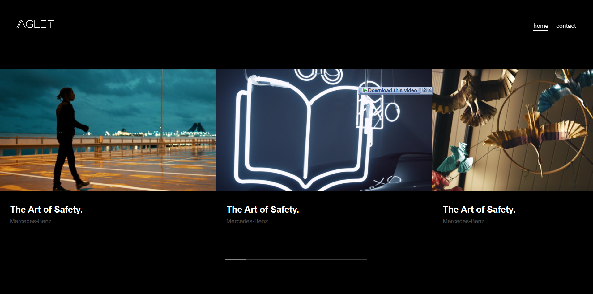

# Aglet Frontend Challenge 2023

## Welcome! 👋

Thanks for checking out this frontend coding challenge. 

[Aglet](http://aglet.co.za/) frontend challenges allow you to improve your skills in a real-life workflow.

**To do this challenge, you need a good understanding of Html, Sass and JavaScript.**

## The challenge

You are required to recreate the video slider found on the Antoni website: [https://antoni.de/cases/](https://antoni.de/cases/).

*Please note:* The slider thumbnails/videos do not need to link to another page. In addition, a contact page must be developed.
